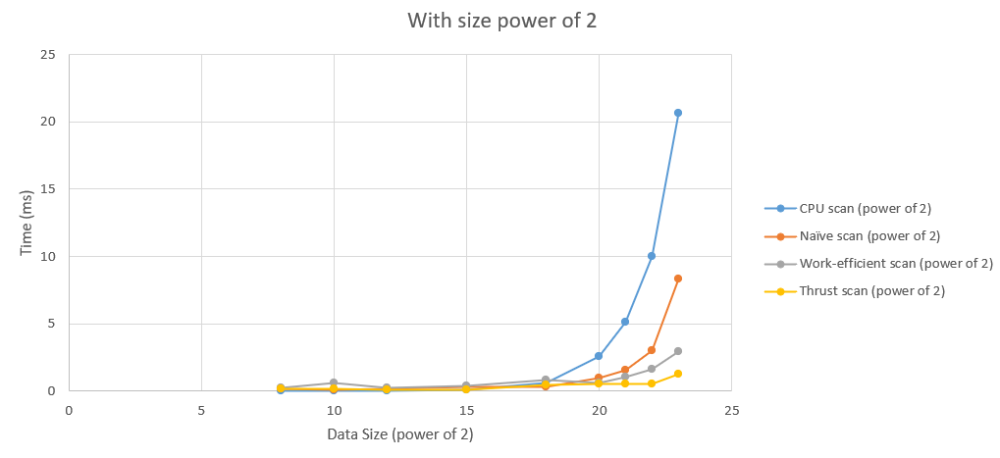

CUDA Stream Compaction
======================

**University of Pennsylvania, CIS 565: GPU Programming and Architecture, Project 2**

* Yuning Wen
  * (TODO) [LinkedIn](), [personal website](), [twitter](), etc.
* Tested on: Windows 11, i9-12900H @ 2.50GHz 16GB, NVIDIA GeForce RTX 3060 Laptop GPU (Personal Laptop)

### README

#### Description

* CPU Scan, Stream Compaction

* Naive GPU Scan Algorithm

* Work-Efficient GPU Scan & Stream Compaction

* Thrust test implemented

#### Performance Analysis (Answering Questions)

* Here are the two graphs for the performances of different GPU scan algorithms (Naive, Work-Efficient, and Thrust) and the serial CPU version of Scan.




* I have tried to use Nsight Systems only to check if I may find something. But it seems like cuda is mostly use by my own function, which means thrust may just used little stuff in cuda


  But there is some tiny things inside and that might be used by thrust


  As a result, I guess thurst functions actually make a great use of parallel calculation in CPU, or have excellent algorithm that runs in just hundred microseconds and finishes the use of CUDA.

#### Bottlenecks

* From the nsight charts above, I think the current bottleneck is that the efficiency of memory usage is too low, so if I may apply shared memory to my algorithm, the efficiency may then increase.

#### Result of running

```
****************
** SCAN TESTS **
****************
    [  32   7   4  15  27  47  43  11   5  18  44  41  47 ...  30   0 ]
==== cpu scan, power-of-two ====
   elapsed time: 20.1042ms    (std::chrono Measured)
    [   0  32  39  43  58  85 132 175 186 191 209 253 294 ... 205520488 205520518 ]
==== cpu scan, non-power-of-two ====
   elapsed time: 19.9824ms    (std::chrono Measured)
    [   0  32  39  43  58  85 132 175 186 191 209 253 294 ... 205520437 205520458 ]
    passed
==== naive scan, power-of-two ====
   elapsed time: 7.2087ms    (CUDA Measured)
    passed
==== naive scan, non-power-of-two ====
   elapsed time: 6.83536ms    (CUDA Measured)
    passed
==== work-efficient scan, power-of-two ====
   elapsed time: 2.68765ms    (CUDA Measured)
    passed
==== work-efficient scan, non-power-of-two ====
   elapsed time: 2.97347ms    (CUDA Measured)
    passed
==== thrust scan, power-of-two ====
   elapsed time: 0.885536ms    (CUDA Measured)
    passed
==== thrust scan, non-power-of-two ====
   elapsed time: 1.02086ms    (CUDA Measured)
    passed

*****************************
** STREAM COMPACTION TESTS **
*****************************
    [   2   1   2   1   1   1   3   3   3   2   0   3   1 ...   2   0 ]
==== cpu compact without scan, power-of-two ====
   elapsed time: 29.0733ms    (std::chrono Measured)
    [   2   1   2   1   1   1   3   3   3   2   3   1   2 ...   2   2 ]
    passed
==== cpu compact without scan, non-power-of-two ====
   elapsed time: 45.5551ms    (std::chrono Measured)
    [   2   1   2   1   1   1   3   3   3   2   3   1   2 ...   1   2 ]
    passed
==== cpu compact with scan ====
   elapsed time: 83.1376ms    (std::chrono Measured)
    [   2   1   2   1   1   1   3   3   3   2   3   1   2 ...   2   2 ]
    passed
==== work-efficient compact, power-of-two ====
   elapsed time: 2.79856ms    (CUDA Measured)
    passed
==== work-efficient compact, non-power-of-two ====
   elapsed time: 2.45539ms    (CUDA Measured)
    passed
```